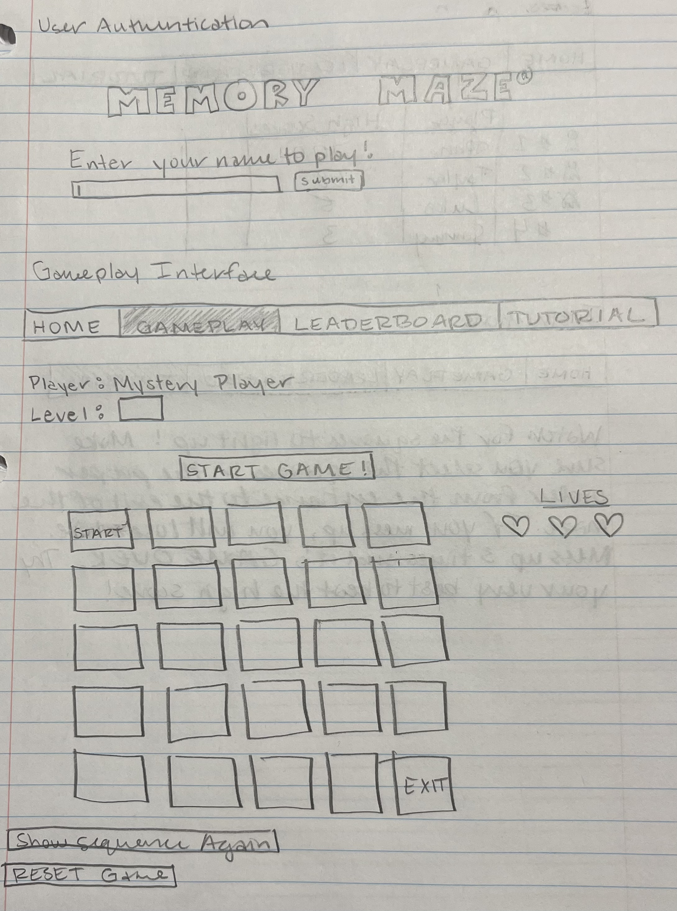
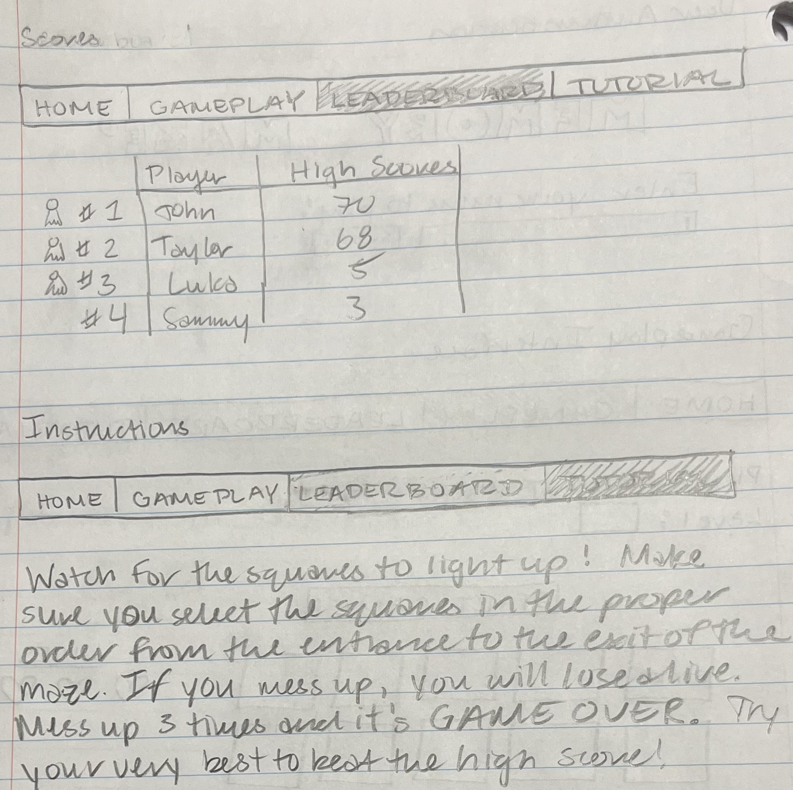

# Memory Maze

## Specification Deliverable
### Elevator Pitch
Introducing "Memory Maze"-- the ultimate challenge for your memorizing skills! Immerse yourself in a simple game, where a 5x5 grid flashes individual squares in a certain pattern. The way to win is to click the squares in the correct order and exit the maze. Sounds easy right? But hold on, each round amps up the challenge. With each successful round, the challenge increases difficulty as more squares join the memory dance. How far can you go before the grid outsmarts you? Sharpen your instincts and give your brain a good workout by challenging yourself to Memory Maze!

### Design

### Key features
* Allow users to create accounts and log in
* Display the user's name after log in
* Display of 5x5 grid
* Display of current round number to indicate difficulty level
* Display of "lives" showing how many tries the user has left to successfully pass a level
* Ability to select any squares in 5x5 grid starting with the top left square and ending with the bottom right square
* Highlight square(s) in different colors and in a sequential order for the user to click
* Ability for the user to show the sequence a second time
* Ability for the user to restart the game
* Scores from all users displayed in realtime
* Store user profiles, including high scores
* Results are persistently stored
* Display a leaderboard showing the highest scores achieved by users

### Technologies
I am going to use the required technologies in the following ways. 
* **HTML** - I will utilize HTML to create a structured application with separate pages for user authentication, gameplay interface, the leaderboard, and the tutorial. I will also utilize HTML to implement hyperlinks to navigate between different sections of the web program.
* **CSS**  - I will use CSS to make my gameplay interface visually appealing and have a responsive design. I will use proper whitespace, color schemes, and contrast to enhance the user experience. 
* **JavaScript** - I will employ Javascript with user authentication. I will also use it to develop the gameplay logic such as highlighting squares, handling user clicks, and managing progressive difficulty. I will utilize backend endpoint calls for seamless interaction with the server. 
* **Service** - I will have backend service with the following endpoints:
    * Login
    * Gameplay
    * Scores
    * Tutorial
    * Websocket
* **Database** - I will implement a database to store user profiles including login credentials and high scores. I will also ensure secure storage of user credentials in the database and persistently store game progress and scores. 
* **Websocket** - I will integrate WebSocket for real-time communication between users. I will also use Websocket to broadcast data on each round (sequence of flashing squares).
* **React** - I will port the application to use the React web framework for enhanced modularity and maintainability. I will also leverage React components for the login page, gameplay interface leaderboard, and tutorial.

## HTML deliverable
For this deliverable I built out the structure of my application using HTML.
* **HTML pages** - I have four HTML pages that are necessary for my website application.
    * **index.html** - This is the home page where players can enter the name to participate in the game.
    * **gameplay.html** - This page is where the player can interact with a 5x5 maze grid to play the game.
    * **leaderboard.html** - This page shows the top scores of players that have played the game.
    * **tutorial.html** - This page explains how players play the game.
* **HTML tags** - I used HTML tags such as BODY, NAV, MAIN, HEADER, and FOOTER to properly format my HTML structure for this website application.
* **Links** - The login page automatically links to the gameplay page when users input their name. The gameplay, leaderboard, and tutorial pages include links to ever other page (including the login page).
* **Text** - Appropriate text is used on each page such as instructions for how to play the game and descriptive phrases to help the user.
* **3rd Party Service Calls** - My leaderboard will in the future use third-party service calls to manage and retrieve scores from different players globally.
* **Images** - I have used application images for the logo of my game. This is displayed in the browser tab. 
* **Login** - I have a box in my home tab where a user will input their name to start playing. Their user name will be displayed at the top of the page in gameplay.html.
* **Database** - The leaderboard will later be populated with actual player scores and names retrieved from my database. The user name displayed in gameplay.html will also be using database data.
* **WebSocket** - This is generated from realtime data from my service. This is updated every time another user creates or ends a game.

